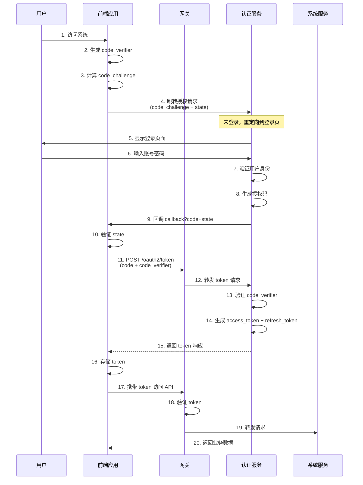
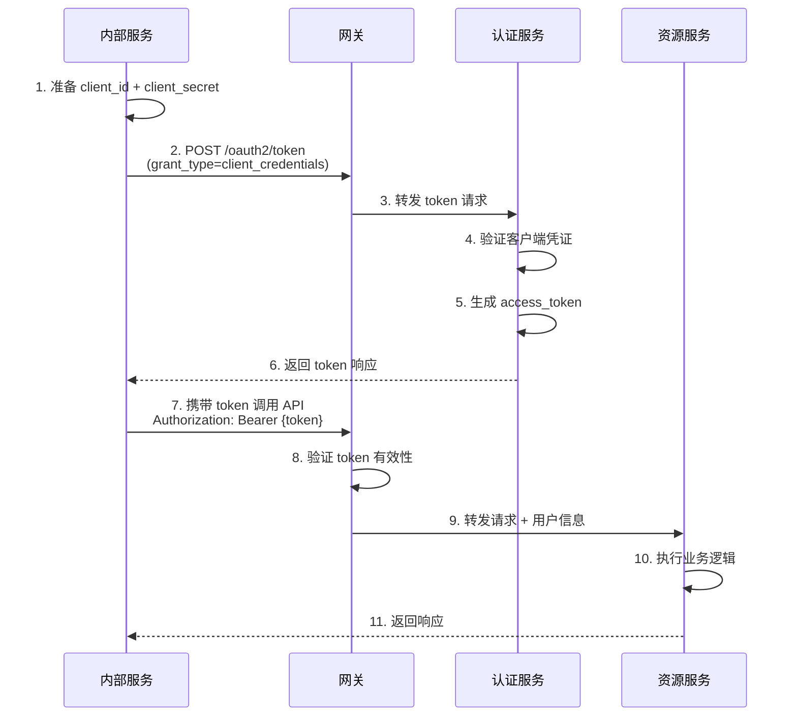

# JNet 权限框架技术方案

## 一、技术架构

https://github.com/james8828/system-admin.git

### 1.1 技术栈

- **Spring Boot 3.x** - 基础框架
- **Spring Security 6.x** - 安全框架
- **Spring Authorization Server** - OAuth2 认证服务器
- **Spring Cloud Gateway** - 网关层权限控制
- **MyBatis Plus** - ORM 框架
- **Redis** - Token 存储和权限缓存
- **JWT** - 令牌格式

### 1.2 架构层次
```
┌─────────────────────────────────────────────────────┐
│                 前端应用层                          │
│  (Vue/React + OpenID Connect)                       │
└────────────────┬────────────────────────────────────┘
                 │
┌────────────────▼────────────────────────────────────┐
│              API Gateway Layer                      │
│   (Spring Cloud Gateway + 动态权限过滤)             │
└────────────────┬────────────────────────────────────┘
                 │
┌────────────────▼────────────────────────────────────┐
│         OAuth2 Authorization Server                 │
│   (认证 + 授权 + Token 管理)                         │
└────────────────┬────────────────────────────────────┘
                 │
┌────────────────▼────────────────────────────────────┐
│           Resource Server (微服务)                  │
│   (业务服务 + 方法级权限控制)                        │
└─────────────────────────────────────────────────────┘
```

## 二、基础权限模型设计

### 2.1 RBAC 权限模型

采用 **RBAC（Role-Based Access Control）** 模型，支持以下核心概念：

#### 2.1.1 用户（User）
系统操作主体，支持多种类型（普通用户、管理员、第三方应用等）

#### 2.1.2 角色（Role）
权限的集合，作为用户和权限之间的桥梁

#### 2.1.3 资源（Resource/Menu）
系统可访问的资源，包括：
- **目录（Directory）**：一级菜单
- **菜单（Menu）**：二级菜单
- **按钮（Button）**：操作按钮
- **接口（API）**：后端接口权限

#### 2.1.4 数据权限（Data Scope）
控制用户可访问的数据范围：
- 全部数据权限
- 本部门及以下数据权限
- 本部门数据权限
- 仅本人数据权限
- 自定义数据权限

### 2.2 扩展功能

#### 2.2.1 多租户支持
- 租户隔离
- 租户级权限配置

#### 2.2.2 动态权限
- URL 动态授权
- 方法级动态权限
- 表达式权限（SpEL）

#### 2.2.3 审计日志
- 登录日志
- 操作日志
- 权限变更日志

## 三、数据库表结构设计

### 3.1 核心表结构

#### 3.1.1 用户表（sys_user）
```sql
CREATE TABLE sys_user (
    user_id BIGINT PRIMARY KEY AUTO_INCREMENT COMMENT '用户 ID',
    user_name VARCHAR(50) NOT NULL UNIQUE COMMENT '用户名',
    password VARCHAR(255) NOT NULL COMMENT '密码（加密）',
    nick_name VARCHAR(50) COMMENT '昵称',
    head_img_url VARCHAR(500) COMMENT '头像 URL',
    mobile VARCHAR(20) COMMENT '手机号',
    sex TINYINT DEFAULT 0 COMMENT '性别（0 未知 1 男 2 女）',
    email VARCHAR(100) COMMENT '邮箱',
    enabled BOOLEAN DEFAULT TRUE COMMENT '启用状态',
    type VARCHAR(20) DEFAULT 'USER' COMMENT '用户类型（USER ADMIN APP）',
    company VARCHAR(100) COMMENT '所属公司',
    open_id VARCHAR(100) COMMENT '第三方 openid',
    tenant_id BIGINT COMMENT '租户 ID',
    dept_id BIGINT COMMENT '部门 ID',
    create_by BIGINT COMMENT '创建人',
    create_time DATETIME DEFAULT CURRENT_TIMESTAMP COMMENT '创建时间',
    update_by BIGINT COMMENT '更新人',
    update_time DATETIME DEFAULT CURRENT_TIMESTAMP ON UPDATE CURRENT_TIMESTAMP COMMENT '更新时间',
    del_flag BOOLEAN DEFAULT FALSE COMMENT '删除标志（0 未删除 1 已删除）',
    remark VARCHAR(500) COMMENT '备注',
    INDEX idx_username (user_name),
    INDEX idx_mobile (mobile),
    INDEX idx_tenant (tenant_id),
    INDEX idx_dept (dept_id)
) ENGINE=InnoDB DEFAULT CHARSET=utf8mb4 COMMENT='用户表';
```

#### 3.1.2 角色表（sys_role）
```sql
CREATE TABLE sys_role (
    role_id BIGINT PRIMARY KEY AUTO_INCREMENT COMMENT '角色 ID',
    role_name VARCHAR(50) NOT NULL COMMENT '角色名称',
    role_key VARCHAR(50) NOT NULL UNIQUE COMMENT '角色权限字符串',
    role_sort INT DEFAULT 0 COMMENT '显示顺序',
    enabled BOOLEAN DEFAULT TRUE COMMENT '启用状态',
    data_scope VARCHAR(20) DEFAULT 'ALL' COMMENT '数据范围（ALL:全部数据 DEPT:本部门及以下 DEPT_ONLY:本部门 SELF:仅本人 CUSTOM:自定义）',
    tenant_id BIGINT COMMENT '租户 ID',
    create_by BIGINT COMMENT '创建人',
    create_time DATETIME DEFAULT CURRENT_TIMESTAMP COMMENT '创建时间',
    update_by BIGINT COMMENT '更新人',
    update_time DATETIME DEFAULT CURRENT_TIMESTAMP ON UPDATE CURRENT_TIMESTAMP COMMENT '更新时间',
    del_flag BOOLEAN DEFAULT FALSE COMMENT '删除标志',
    remark VARCHAR(500) COMMENT '备注',
    UNIQUE KEY uk_role_key (role_key),
    INDEX idx_tenant (tenant_id)
) ENGINE=InnoDB DEFAULT CHARSET=utf8mb4 COMMENT='角色表';
```

#### 3.1.3 菜单资源表（sys_menu）
```sql
CREATE TABLE sys_menu (
    menu_id BIGINT PRIMARY KEY AUTO_INCREMENT COMMENT '资源 ID',
    menu_name VARCHAR(50) NOT NULL COMMENT '资源名称',
    path VARCHAR(200) COMMENT '路由地址',
    component VARCHAR(255) COMMENT '前端组件路径',
    visible BOOLEAN DEFAULT TRUE COMMENT '是否显示在菜单栏',
    enabled BOOLEAN DEFAULT TRUE COMMENT '是否启用',
    perms VARCHAR(100) COMMENT '权限标识（如 user:list, user:create）',
    icon VARCHAR(100) COMMENT '图标',
    type TINYINT NOT NULL DEFAULT 0 COMMENT '资源类型（0=目录 1=菜单 2=按钮 3=接口）',
    parent_id BIGINT DEFAULT 0 COMMENT '父级资源 ID',
    order_num INT DEFAULT 0 COMMENT '显示顺序',
    query_params VARCHAR(255) COMMENT '路由参数',
    is_cache BOOLEAN DEFAULT FALSE COMMENT '是否缓存',
    is_frame BOOLEAN DEFAULT TRUE COMMENT '是否外链',
    tenant_id BIGINT COMMENT '租户 ID',
    create_by BIGINT COMMENT '创建人',
    create_time DATETIME DEFAULT CURRENT_TIMESTAMP COMMENT '创建时间',
    update_by BIGINT COMMENT '更新人',
    update_time DATETIME DEFAULT CURRENT_TIMESTAMP ON UPDATE CURRENT_TIMESTAMP COMMENT '更新时间',
    del_flag BOOLEAN DEFAULT FALSE COMMENT '删除标志',
    remark VARCHAR(500) COMMENT '备注',
    INDEX idx_parent (parent_id),
    INDEX idx_type (type),
    INDEX idx_perms (perms),
    INDEX idx_tenant (tenant_id)
) ENGINE=InnoDB DEFAULT CHARSET=utf8mb4 COMMENT='菜单资源表';
```

#### 3.1.4 用户角色关联表（sys_user_role）
```sql
CREATE TABLE sys_user_role (
    id BIGINT PRIMARY KEY AUTO_INCREMENT COMMENT '主键',
    user_id BIGINT NOT NULL COMMENT '用户 ID',
    role_id BIGINT NOT NULL COMMENT '角色 ID',
    create_time DATETIME DEFAULT CURRENT_TIMESTAMP COMMENT '创建时间',
    UNIQUE KEY uk_user_role (user_id, role_id),
    INDEX idx_user (user_id),
    INDEX idx_role (role_id)
) ENGINE=InnoDB DEFAULT CHARSET=utf8mb4 COMMENT='用户角色关联表';
```

#### 3.1.5 角色菜单关联表（sys_role_menu）
```sql
CREATE TABLE sys_role_menu (
    id BIGINT PRIMARY KEY AUTO_INCREMENT COMMENT '主键',
    role_id BIGINT NOT NULL COMMENT '角色 ID',
    menu_id BIGINT NOT NULL COMMENT '菜单 ID',
    create_time DATETIME DEFAULT CURRENT_TIMESTAMP COMMENT '创建时间',
    UNIQUE KEY uk_role_menu (role_id, menu_id),
    INDEX idx_role (role_id),
    INDEX idx_menu (menu_id)
) ENGINE=InnoDB DEFAULT CHARSET=utf8mb4 COMMENT='角色菜单关联表';
```

#### 3.1.6 OAuth2 客户端表（oauth2_registered_client）
```sql
CREATE TABLE oauth2_registered_client (
    id VARCHAR(100) PRIMARY KEY COMMENT '客户端 ID',
    client_id VARCHAR(100) NOT NULL UNIQUE COMMENT '客户端 ID',
    client_id_issued_at DATETIME DEFAULT CURRENT_TIMESTAMP COMMENT '客户端 ID 签发时间',
    client_secret VARCHAR(200) COMMENT '客户端密钥',
    client_secret_expires_at DATETIME COMMENT '客户端密钥过期时间',
    client_name VARCHAR(200) NOT NULL COMMENT '客户端名称',
    client_authentication_methods VARCHAR(1000) COMMENT '客户端认证方式',
    authorization_grant_types VARCHAR(1000) COMMENT '授权类型',
    redirect_uris VARCHAR(1000) COMMENT '重定向 URI',
    post_logout_redirect_uris VARCHAR(1000) COMMENT '登出重定向 URI',
    scopes VARCHAR(1000) COMMENT '授权范围',
    client_settings VARCHAR(2000) COMMENT '客户端设置',
    token_settings VARCHAR(2000) COMMENT '令牌设置',
    tenant_id BIGINT COMMENT '租户 ID',
    create_time DATETIME DEFAULT CURRENT_TIMESTAMP COMMENT '创建时间',
    update_time DATETIME DEFAULT CURRENT_TIMESTAMP ON UPDATE CURRENT_TIMESTAMP COMMENT '更新时间',
    INDEX idx_client_id (client_id),
    INDEX idx_tenant (tenant_id)
) ENGINE=InnoDB DEFAULT CHARSET=utf8mb4 COMMENT='OAuth2 客户端表';
```

#### 3.1.7 OAuth2 授权表（oauth2_authorization）
```sql
CREATE TABLE oauth2_authorization (
    id VARCHAR(100) PRIMARY KEY COMMENT '授权 ID',
    registered_client_id VARCHAR(100) NOT NULL COMMENT '客户端 ID',
    principal_name VARCHAR(200) NOT NULL COMMENT '用户标识',
    authorization_grant_type VARCHAR(100) NOT NULL COMMENT '授权类型',
    authorized_scopes VARCHAR(1000) COMMENT '授权范围',
    attributes TEXT COMMENT '属性',
    state VARCHAR(500) COMMENT '状态',
    authorization_code_value TEXT COMMENT '授权码',
    authorization_code_issued_at DATETIME COMMENT '授权码签发时间',
    authorization_code_expires_at DATETIME COMMENT '授权码过期时间',
    authorization_code_metadata TEXT COMMENT '授权码元数据',
    access_token_value TEXT COMMENT '访问令牌',
    access_token_issued_at DATETIME COMMENT '访问令牌签发时间',
    access_token_expires_at DATETIME COMMENT '访问令牌过期时间',
    access_token_metadata TEXT COMMENT '访问令牌元数据',
    access_token_type VARCHAR(100) COMMENT '访问令牌类型',
    access_token_scopes VARCHAR(1000) COMMENT '访问令牌范围',
    oidc_id_token_value TEXT COMMENT 'OIDC ID 令牌',
    oidc_id_token_issued_at DATETIME COMMENT 'OIDC ID 令牌签发时间',
    oidc_id_token_expires_at DATETIME COMMENT 'OIDC ID 令牌过期时间',
    oidc_id_token_metadata TEXT COMMENT 'OIDC ID 令牌元数据',
    refresh_token_value TEXT COMMENT '刷新令牌',
    refresh_token_issued_at DATETIME COMMENT '刷新令牌签发时间',
    refresh_token_expires_at DATETIME COMMENT '刷新令牌过期时间',
    refresh_token_metadata TEXT COMMENT '刷新令牌元数据',
    user_code_value TEXT COMMENT '用户代码',
    user_code_issued_at DATETIME COMMENT '用户代码签发时间',
    user_code_expires_at DATETIME COMMENT '用户代码过期时间',
    user_code_metadata TEXT COMMENT '用户代码元数据',
    device_code_value TEXT COMMENT '设备代码',
    device_code_issued_at DATETIME COMMENT '设备代码签发时间',
    device_code_expires_at DATETIME COMMENT '设备代码过期时间',
    device_code_metadata TEXT COMMENT '设备代码元数据',
    create_time DATETIME DEFAULT CURRENT_TIMESTAMP COMMENT '创建时间',
    update_time DATETIME DEFAULT CURRENT_TIMESTAMP ON UPDATE CURRENT_TIMESTAMP COMMENT '更新时间',
    INDEX idx_client (registered_client_id),
    INDEX idx_principal (principal_name),
    INDEX idx_access_token (access_token_value(255)),
    INDEX idx_refresh_token (refresh_token_value(255))
) ENGINE=InnoDB DEFAULT CHARSET=utf8mb4 COMMENT='OAuth2 授权表';
```

#### 3.1.8 部门表（sys_dept）
```sql
CREATE TABLE sys_dept (
    dept_id BIGINT PRIMARY KEY AUTO_INCREMENT COMMENT '部门 ID',
    parent_id BIGINT DEFAULT 0 COMMENT '父部门 ID',
    ancestors VARCHAR(500) COMMENT '祖级列表',
    dept_name VARCHAR(50) NOT NULL COMMENT '部门名称',
    order_num INT DEFAULT 0 COMMENT '显示顺序',
    leader VARCHAR(50) COMMENT '负责人',
    phone VARCHAR(20) COMMENT '联系电话',
    email VARCHAR(100) COMMENT '邮箱',
    status BOOLEAN DEFAULT TRUE COMMENT '部门状态',
    tenant_id BIGINT COMMENT '租户 ID',
    create_by BIGINT COMMENT '创建人',
    create_time DATETIME DEFAULT CURRENT_TIMESTAMP COMMENT '创建时间',
    update_by BIGINT COMMENT '更新人',
    update_time DATETIME DEFAULT CURRENT_TIMESTAMP ON UPDATE CURRENT_TIMESTAMP COMMENT '更新时间',
    del_flag BOOLEAN DEFAULT FALSE COMMENT '删除标志',
    INDEX idx_parent (parent_id),
    INDEX idx_tenant (tenant_id)
) ENGINE=InnoDB DEFAULT CHARSET=utf8mb4 COMMENT='部门表';
```

#### 3.1.9 操作日志表（sys_oper_log）
```sql
CREATE TABLE sys_oper_log (
    oper_id BIGINT PRIMARY KEY AUTO_INCREMENT COMMENT '日志 ID',
    title VARCHAR(50) COMMENT '模块标题',
    business_type VARCHAR(20) COMMENT '业务类型',
    method VARCHAR(100) COMMENT '方法名称',
    request_method VARCHAR(10) COMMENT '请求方式',
    operator_type VARCHAR(20) COMMENT '操作人类别',
    oper_name VARCHAR(50) COMMENT '操作人员',
    dept_name VARCHAR(50) COMMENT '部门名称',
    oper_url VARCHAR(255) COMMENT '请求 URL',
    oper_ip VARCHAR(50) COMMENT '主机地址',
    oper_location VARCHAR(255) COMMENT '操作地点',
    oper_param VARCHAR(2000) COMMENT '请求参数',
    json_result VARCHAR(2000) COMMENT '返回参数',
    status BOOLEAN DEFAULT TRUE COMMENT '操作状态',
    error_msg VARCHAR(2000) COMMENT '错误消息',
    oper_time DATETIME DEFAULT CURRENT_TIMESTAMP COMMENT '操作时间',
    cost_time BIGINT COMMENT '消耗时间',
    tenant_id BIGINT COMMENT '租户 ID',
    INDEX idx_oper_time (oper_time),
    INDEX idx_tenant (tenant_id)
) ENGINE=InnoDB DEFAULT CHARSET=utf8mb4 COMMENT='操作日志表';
```

## 四、核心功能实现

### 4.1 OAuth2 认证服务器配置

#### 4.1.1 授权服务器配置
- 支持多种授权模式：授权码模式、密码模式、客户端模式、刷新令牌
- JWT 令牌格式，支持自定义 Claims
- Token 持久化到 Redis
- 支持多客户端配置
- 支持多租户

#### 4.1.2 认证流程
```
1. 用户登录 → 2. 认证服务器验证 → 3. 生成 Token 
→ 4. 携带 Token 访问资源 → 5. 网关校验 Token 
→ 6. 资源服务器鉴权 → 7. 返回结果
```

### 4.1.3 PKCE模式流程



**PKCE模式特点：**
- ✅ 适用于前后端分离架构
- ✅ 无需 client_secret，更安全
- ✅ 防止授权码截获攻击
- ✅ 支持移动端和 SPA 应用

### 4.1.4 Client Credentials 模式流程



**Client Credentials 模式特点：**
- ✅ 适用于微服务间调用
- ✅ 无需用户参与
- ✅ 基于客户端身份认证
- ✅ 高性能场景（无用户上下文）
- ⚠️ 不支持用户级权限控制

### 4.1.5 **两种客户端类型的区别**

| 特性              | 公开客户端 (Public Client) | 保密客户端 (Confidential Client) |
| ----------------- | -------------------------- | -------------------------------- |
| **client_secret** | ❌ **没有**                 | ✅ **有**                         |
| **客户端认证**    | ❌ 无法进行                 | ✅ 必须进行                       |
| **典型场景**      | SPA、移动端、桌面应用      | 后端服务、服务器应用             |
| **PKCE 支持**     | ✅ **必须使用**             | ⚠️ 可选（建议也用）               |
| **示例**          | Vue/React 前端             | Spring Boot 后端                 |

### 4.2 网关层权限控制

#### 4.2.1 全局过滤器
- Token 校验
- 用户信息解析
- 权限预加载
- 黑白名单管理

#### 4.2.2 动态路由
- 基于菜单配置动态路由
- 支持路由拦截
- 支持路由重写

### 4.3 资源服务器权限控制

#### 4.3.1 URL 级别权限
- 基于角色的 URL 访问控制
- 动态权限规则
- 支持正则匹配

#### 4.3.2 方法级权限
- @PreAuthorize 注解
- 自定义权限表达式
- 数据权限过滤

### 4.4 数据权限实现

#### 4.4.1 数据范围类型
- ALL：全部数据
- DEPT：本部门及以下
- DEPT_ONLY：本部门
- SELF：仅本人
- CUSTOM：自定义

#### 4.4.2 SQL 拦截器
- MyBatis 拦截器
- 自动拼接数据权限 SQL
- 支持多表关联

## 五、技术特性

### 5.1 安全性
- BCrypt 密码加密
- JWT 签名验证
- Token 黑名单机制
- 防重放攻击
- XSS 防护
- CSRF 防护

### 5.2 性能优化
- Redis 缓存权限数据
- 多级缓存策略
- 异步日志记录
- 连接池优化

### 5.3 可扩展性
- 插件化架构
- SPI 扩展机制
- 事件驱动设计
- 观察者模式

### 5.4 监控与审计
- 操作日志记录
- 登录日志追踪
- 权限变更审计
- 实时在线用户监控

## 六、部署方案

### 6.1 环境要求
- JDK 17+
- MySQL 8.0+ / PostgreSQL 14+
- Redis 6.0+
- Maven 3.8+

### 6.2 集群部署
- OAuth2 服务器集群
- Redis 哨兵/集群
- 数据库主从复制
- Nginx 负载均衡

### 6.3 容器化
- Docker 镜像
- Kubernetes 部署
- Helm Chart

## 七、开发规范

### 7.1 代码规范
- 阿里巴巴 Java 开发手册
- RESTful API 设计规范
- 统一的响应格式

### 7.2 权限标识规范
```
格式：{module}:{action}:{resource}
示例：
- system:user:list      - 系统管理 - 用户管理 - 查询
- system:user:create    - 系统管理 - 用户管理 - 新增
- system:user:update    - 系统管理 - 用户管理 - 修改
- system:user:delete    - 系统管理 - 用户管理 - 删除
```

### 7.3 角色命名规范
```
格式：{scope}_{role_name}
示例：
- admin                 - 超级管理员
- system_admin          - 系统管理员
- dept_manager          - 部门经理
- common_user           - 普通用户
```

## 八、API 接口设计

### 8.1 认证接口
```
POST /oauth2/token                    - 获取访问令牌
POST /oauth2/revoke                   - 撤销令牌
GET  /oauth2/introspect               - 内省令牌
POST /oauth2/logout                   - 登出
```

### 8.2 用户管理接口
```
GET    /api/system/users             - 用户列表
GET    /api/system/users/{userId}    - 用户详情
POST   /api/system/users             - 创建用户
PUT    /api/system/users/{userId}    - 更新用户
DELETE /api/system/users/{userId}    - 删除用户
POST   /api/system/users/resetPwd    - 重置密码
```

### 8.3 角色管理接口
```
GET    /api/system/roles             - 角色列表
GET    /api/system/roles/{roleId}    - 角色详情
POST   /api/system/roles             - 创建角色
PUT    /api/system/roles/{roleId}    - 更新角色
DELETE /api/system/roles/{roleId}    - 删除角色
GET    /api/system/roles/{roleId}/users        - 角色用户列表
POST   /api/system/roles/{roleId}/users        - 分配用户
DELETE /api/system/roles/{roleId}/users        - 移除用户
```

### 8.4 菜单管理接口
```
GET    /api/system/menus             - 菜单树
GET    /api/system/menus/list        - 菜单列表
GET    /api/system/menus/{menuId}    - 菜单详情
POST   /api/system/menus             - 创建菜单
PUT    /api/system/menus/{menuId}    - 更新菜单
DELETE /api/system/menus/{menuId}    - 删除菜单
GET    /api/system/menus/roleMenus - 获取角色菜单
```

### 8.5 客户端管理接口
```
GET    /api/system/oauth2/client/page              - 客户端列表（分页）
GET    /api/system/oauth2/client/{id}              - 客户端详情
GET    /api/system/oauth2/client/byClientId/{clientId} - 根据 ClientId 查询
POST   /api/system/oauth2/client                   - 创建客户端
PUT    /api/system/oauth2/client                   - 更新客户端
DELETE /api/system/oauth2/client/{id}              - 删除客户端
POST   /api/system/oauth2/client/refresh-secret/{clientId} - 刷新客户端密钥
```

### 8.6 授权管理接口
```
GET    /api/system/oauth2/authorization/page       - 授权列表（分页）
GET    /api/system/oauth2/authorization/{id}       - 授权详情
GET    /api/system/oauth2/authorization/client/{clientId} - 根据客户端查询授权
GET    /api/system/oauth2/authorization/principal/{principalName} - 根据用户查询授权
DELETE /api/system/oauth2/authorization/{id}       - 撤销授权
DELETE /api/system/oauth2/authorization/by-access-token - 根据 Access Token 撤销授权
DELETE /api/system/oauth2/authorization/by-refresh-token - 根据 Refresh Token 撤销授权
POST   /api/system/oauth2/authorization/cleanup    - 清理过期授权
```

### 8.7 权限校验接口
```
GET  /api/system/permissions/check     - 检查权限
POST /api/system/permissions/hasPerm   - 是否有权限
GET  /api/system/permissions/routeTree - 路由树
```

### 8.8 权限管理接口（System Admin API）
```
GET    /admin/permissions/user/{userId}                    - 获取用户权限标识集合
GET    /admin/permissions/user/{userId}/check              - 检查用户权限
POST   /admin/permissions/user/{userId}/batch-check        - 批量检查用户权限
GET    /admin/permissions/user/{userId}/menu-tree          - 获取用户菜单权限树
GET    /admin/permissions/page                             - 分页查询权限列表
GET    /admin/permissions/{menuId}                         - 获取权限详情
POST   /admin/permissions                                  - 创建权限
PUT    /admin/permissions/{menuId}                         - 更新权限
DELETE /admin/permissions/{menuId}                         - 删除权限
DELETE /admin/permissions/batch                            - 批量删除权限
POST   /admin/permissions/role/{roleId}/menus              - 为角色分配菜单权限
GET    /admin/permissions/role/{roleId}/perms              - 获取角色的权限标识列表
POST   /admin/permissions/refresh/user/{userId}            - 刷新用户权限缓存
POST   /admin/permissions/clear/role/{roleId}              - 清除角色权限缓存
```

## 九、最佳实践

### 9.1 权限设计原则
- 最小权限原则
- 职责分离原则
- 默认拒绝原则
- 权限继承合理控制

### 9.2 安全建议
- 定期更换密钥
- 启用双因素认证
- 限制登录失败次数
- 会话超时管理
- 敏感操作二次验证

### 9.3 性能调优
- 合理使用缓存
- 批量操作优化
- 分页查询
- 慢查询监控

## 十、未来规划

### 10.1 短期目标
- [ ] 完善单元测试
- [ ] 集成 LDAP/AD
- [ ] 社交账号登录
- [ ] 短信验证码登录

### 10.2 中期目标
- [ ] 工作流引擎集成
- [ ] 审批流程
- [ ] 数据导出权限控制
- [ ] API 限流

### 10.3 长期目标
- [ ] AI 智能权限推荐
- [ ] 零信任安全架构
- [ ] 区块链存证
- [ ] 国密算法支持
